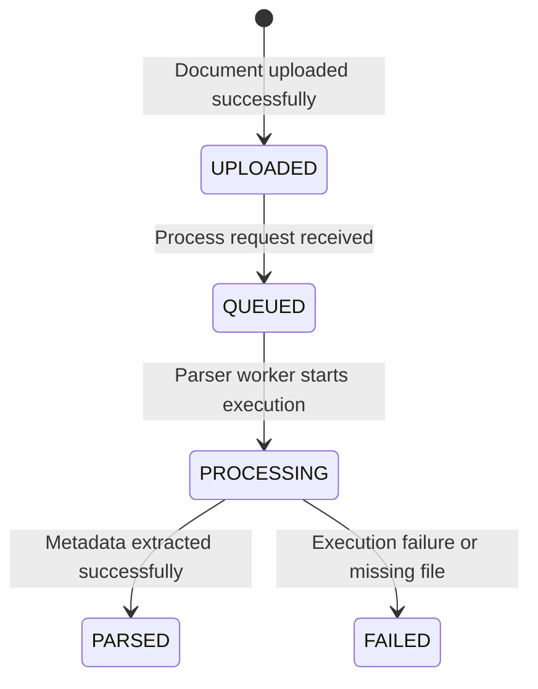

# FinanceAI Copilot

Enterprise-grade AI platform designed to help finance teams analyze invoices, expense reports, audit reports, vendor statements, and company policies. Built with Next.js, FastAPI, PostgreSQL, SQLAlchemy, LangGraph, and Docker.

## Project Architecture

```
finance-ai-copilot/
├── frontend/             # Next.js 16 (App Router, TS, Tailwind, shadcn/ui)
├── backend/              # Python 3.12 (FastAPI, SQLAlchemy, LangGraph, OCR/PDF tools)
├── docker/               # Docker & Compose configurations
├── docs/                 # Design documents and APIs
├── sample_data/          # Document categories for RAG testing
└── storage/              # Dedicated persistent volume for files, logs, and indices
    ├── uploads/          # Uploaded invoice/report documents
    ├── parsed/           # Parsed text and JSON structures
    ├── embeddings/       # Local cached vector embeddings
    ├── faiss/            # FAISS index files
    ├── generated_reports/# Output reports
    └── logs/             # Application structural log files (app.log)
```

### Backend Components
- **FastAPI Core**: Request handling, routing, dependency injection. Enforces secure, non-default `SECRET_KEY` env validation.
- **SQLAlchemy & Alembic**: Database models, async/sync sessions, migrations.
- **RAG & Agents**: FAISS vector database integration, PyMuPDF + PaddleOCR parser, LangGraph workflow architecture. Uses Groq LLM integration.

---

## Authentication Flow (Sprint 2)

FinanceAI Copilot implements a production-ready, secure **JWT-based authentication** system.

### Components
1. **User Schema Validation**: Built with Pydantic v2. Performs format checks on email and length checks (minimum 8 characters) on user passwords.
2. **Password Security**: Passwords are hashed using `passlib` with `bcrypt` before being committed to the database. Plaintext or hashed passwords are never returned in responses or logged.
3. **Token Verification**: Tokens are encoded and decoded using `python-jose` with the `HS256` algorithm.
4. **Dependencies**:
   - `get_current_user`: Resolves and decodes authorization headers, ensuring JWT authenticity.
   - `get_current_active_user`: Ensures the requesting account is active.

### Endpoints
- **Register Account**: `POST /api/v1/auth/register` (Returns newly created user payload)
- **Login Session**: `POST /api/v1/auth/login` (Standard OAuth2 password flow; returns bearer token)
- **Profile Check**: `GET /api/v1/auth/me` (Returns verified current user metadata)

---

## Document Upload & Management Flow (Sprint 3)

The document management module provides secure file uploads, folder segmenting, size guards, and strict ownership boundaries.

### Storage Layout Segmentation
When a document is uploaded, it is automatically sorted into a type-specific subfolder in `storage/uploads/`:
- **Invoice** -> `storage/uploads/invoices/`
- **Expense Report** -> `storage/uploads/expense_reports/`
- **Audit Report** -> `storage/uploads/audit_reports/`
- **Policy** -> `storage/uploads/policies/`
- **Vendor Statement** -> `storage/uploads/vendor_statements/`

To prevent overrides, filenames are uniquely named using a UUID, while retaining their original names and formats in the PostgreSQL database.

### File Format & Size Limits
- **Maximum File Size**: 20 MB (Empty files are rejected).
- **Supported Formats**: `PDF`, `PNG`, `JPG`, `JPEG`, `CSV`, `XLSX`.
- **MIME Type Checks**: Strict whitelist validation on inbound multipart requests.

### Role & Ownership Controls
- **Standard Users**: Can upload documents and view or delete *only* their own uploaded files.
- **Admin Users**: Have system-wide permission to list, fetch details for, or delete *any* document.

### Endpoints
- **Upload Document**: `POST /api/v1/documents/upload` (Form parameters: `file` & `document_type`)
- **List Documents**: `GET /api/v1/documents`
- **Get Document Details**: `GET /api/v1/documents/{document_id}`
- **Delete Document**: `DELETE /api/v1/documents/{document_id}`

---

## Document Processing Pipeline (Sprint 4)

Sprint 4 introduces structured processing state tracking, failure handling, and physical metadata parsing.

### Processing Lifecycle & States



### Metadata Extracted
When parsing commences, the pipeline reads file properties without invoking heavy OCR or AI loops:
- `filename`: Base name of the stored target file.
- `extension`: Lowercased file extension format.
- `mime_type`: Resolved file payload type.
- `file_size`: Calculated byte size.
- `creation_time`: Host file creation timestamp.
- `last_modified_time`: Host modification timestamp.

### Pipeline Endpoints
- **Trigger Pipeline**: `POST /api/v1/documents/{document_id}/process`
- **Check Pipeline Status**: `GET /api/v1/documents/{document_id}/status`

---

## Invoice Extraction Engine (Sprint 5)

Sprint 5 establishes a modular parsing framework designed to extract raw text and files into structured database records.

### Parser Architecture
```
parsers/
├── base_parser.py       # Abstract Base Class declaring parse()
├── invoice_parser.py    # Concrete Invoice Parser implementing parse()
└── parser_factory.py    # Factory pattern resolving parser based on DocumentType
```

This modular structure decouples the parsing implementation from the FastAPI service layer, enabling future parsers (e.g. Expense Reports, Vendor Statements) to plug in without modifying existing codebase.

### Invoice Entity Relationships
A document categorized as an `Invoice` gets processed and mapped to the SQL database:
```
  [Document] 1 ──── 1 [Invoice] 1 ──── * [InvoiceItem]
                         │
                         * ──── 1 [Vendor]
```

### Endpoints
- **Extract Invoice**: `POST /api/v1/invoices/{document_id}/extract`
- **Get Invoice Details**: `GET /api/v1/invoices/{invoice_id}`
- **List Invoices**: `GET /api/v1/invoices`

---

## OCR & Text Extraction Framework (Sprint 6)

Sprint 6 implements a robust text extraction layer combining digital text crawlers and optical character recognition engines.

### OCR Architecture
```
ocr/
├── base_extractor.py       # Abstract Base Class declaring extract_text()
├── pdf_text_extractor.py   # Uses PyMuPDF (fitz) for searchable PDFs
├── paddle_ocr_extractor.py # Uses PaddleOCR for scanned PDFs and images
├── image_preprocessor.py   # Stubs for image rotations/contrast enhancement
└── extractor_factory.py    # Routes documents automatically based on format and searchability
```

### Extraction Strategy
```mermaid
graph TD
    A[Document Uploaded] --> B{Is PDF?}
    B -- Yes --> C{Is Searchable PDF?}
    C -- Yes --> D[PDFTextExtractor - PyMuPDF]
    C -- No --> E[PaddleOCRExtractor - PaddleOCR]
    B -- No [Image] --> E
    D --> F[Unified DocumentText Schema]
    E --> F
    F --> G[Save storage/parsed/{document_id}.json]
```

### API Endpoints
- **Extract Text**: `POST /api/v1/documents/{document_id}/extract-text`
- **Get Parsed Text**: `GET /api/v1/documents/{document_id}/parsed-text`

---

## Getting Started

### Prerequisites
- Docker & Docker Compose
- Node.js 20+ (for local frontend development)
- Python 3.12+ (for local backend development)

### Environment Setup

1. **Configure Environment Variables:**
   ```bash
   cp backend/.env.example backend/.env
   ```
   Open `backend/.env` and configure:
   - `SECRET_KEY`: Must be generated securely (e.g. `openssl rand -hex 32`). The backend will fail to start if this is missing.
   - `GROQ_API_KEY`: API key for Groq Cloud.
   - `GROQ_MODEL`: LLM model target (defaults to `llama3-8b-8192`).
   - `BACKEND_CORS_ORIGINS`: Comma-separated list of allowed origins.

2. **Quick Start with Docker:**
   ```bash
   docker compose -f docker/docker-compose.yml up --build
   ```

3. **Access Services:**
   - **Frontend App**: `http://localhost:3000`
   - **Backend API**: `http://localhost:8000`
   - **API Swagger Docs**: `http://localhost:8000/docs`
